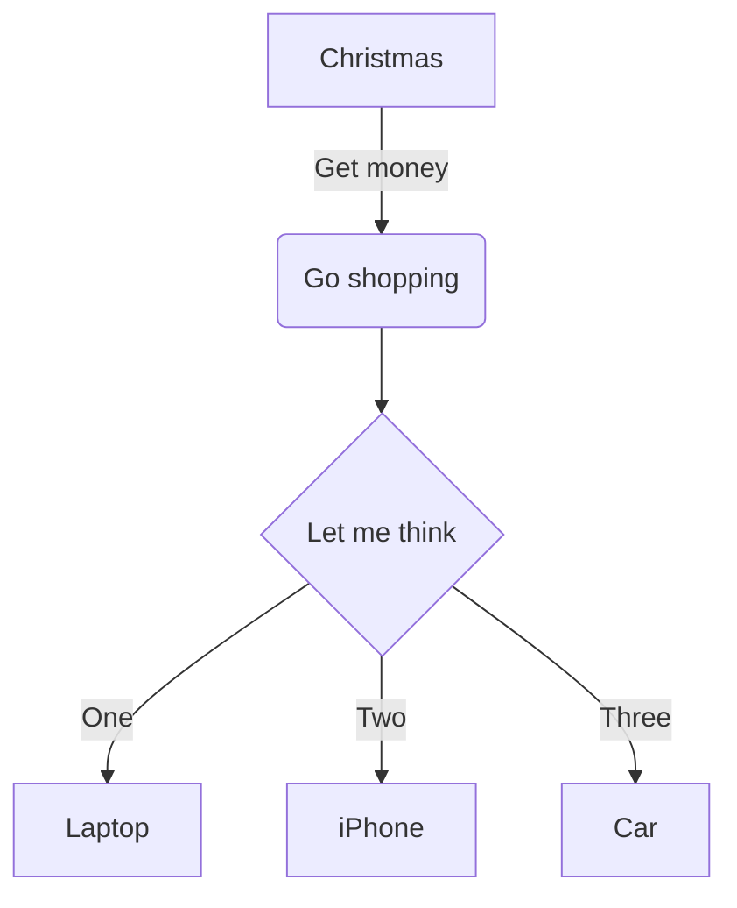

# 标题1

## 标题2

### 标题3

标题H1
====

标题H2
------


## 目录支持

[TOC]


`[TOC]`


## 基本功能


段落
没有空行

有空行


## 列表

- 无序列表1
- 无序列表2


1. 有序列表1
2. 有序列表2


-列表无空格


- 列表
    - 二级列表
+ 列表
    - 二级列表
        - 三级列表
    - 二级列表
- 列表
    - 二级列表
        - 三级列表
            - 四级列表


## 图片与链接


图片


自动链接

测试 http://www.baidu.com 测试

测试http://www.baidu.com 测试

测试http://www.baidu.com测试


## 特殊字体

测试**星号粗体**测试

测试__下划线粗体__测试

测试*斜体*测试

测试~~删除线~~测试

测试==高亮==测试

测试++下划线++测试


## 水平线

减号

---

星号

***

下划线

___


## 引用

> 引用

> 引用
    > 二级引用
        > 三级引用


> 引用
>> 二级引用
>>> 三级引用
>> 二级引用2


## 表格支持

| Tables        | Are           | Cool  |
| ------------- |:-------------:| -----:|
| col 3 is      | right-aligned | $1600 |
| col 2 is      | centered      |   $12 |
| zebra stripes | are neat      |    $1 |


Markdown | Less | Pretty
--- | --- | ---
*Still* | `renders` | **nicely**
1 | 2 | 3


## 代码与高亮

代码块

```cpp
// C++

for (int i = 0; i < 100; i++)
{
    printf("Hello Markdown Hello Markdown Hello Markdown!\n");
}
```


行间代码

测试 `void testMain(int args)` 测试


## 图表支持




## 数学公式支持

Latex公式测试

行内公式 $ \delta = \beta / (\alpha + 1)$

行间公式 $$ \frac{O}{I} \approx \frac{A}{1+AF} $$

上下标 $$ U_o = A^2 * ( U_+ - U_- ) $$

积分 $$ \int_1 ^2 sin x dx $$

方程组
$$
\begin{aligned}
\dot{x} & = \sigma(y-x) \\
\dot{y} & = \rho x - y - xz \\
\dot{z} & = -\beta z + xy
\end{aligned}
$$
